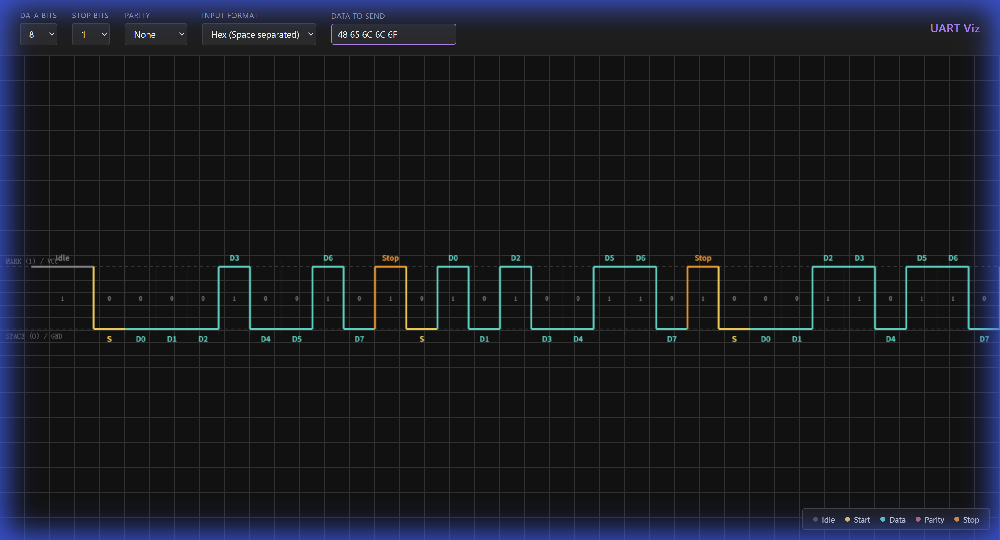
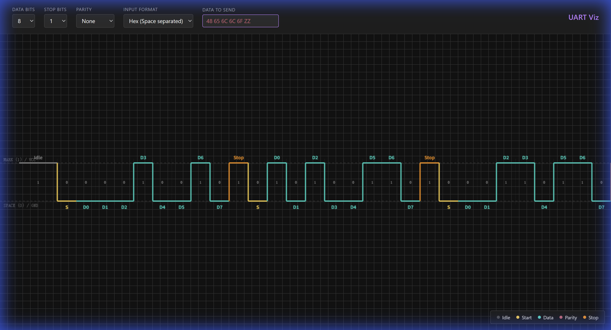

# UART Visualizer

A lightweight, single-file HTML5 tool for visualizing UART (Universal Asynchronous Receiver-Transmitter) waveforms. Designed for students, hobbyists, and engineers to understand and verify UART communication protocols visually.

## Features

*   **Single File**: No dependencies, no installation. Just open `UART_Visualizer.html` in any modern browser.
*   **Configurable Parameters**:
    *   **Data Bits**: 5, 6, 7, 8, or 9 bits.
    *   **Parity**: None, Even, Odd, Mark (1), Space (0).
    *   **Stop Bits**: 1, 1.5, or 2 bits.
*   **Flexible Input**:
    *   **ASCII Mode**: Type text directly to see the corresponding waveform.
    *   **Hex Mode**: Input space-separated hex values (e.g., `48 65 6C`) with auto-formatting and validation.
*   **Interactive Waveform**:
    *   **Zoom**: Mouse wheel to zoom in/out horizontally.
    *   **Pan**: Click and drag to move the waveform.
    *   **Vertical Adjustment**: Drag VCC and GND lines to adjust voltage levels and vertical scaling.

## Demo

### Overview
Visualize standard ASCII data transmission.

### Hex Input Mode
Input raw byte values with automatic spacing.

### Input Validation
Visual feedback (red text) for invalid hex characters.

## Usage

1.  Download `UART_Visualizer.html`.
2.  Open it in Chrome, Firefox, Edge, or Safari.
3.  Adjust the UART settings (Baud rate is abstract, represented by bit width).
4.  Type in the "Data to Send" field to generate the waveform instantly.

## License

MIT License. Feel free to use and modify.
